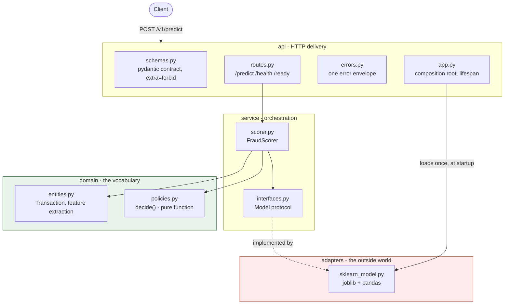

# fraud-service

A production-shaped fraud scoring service: a trained scikit-learn model exposed
over a validated HTTP API, containerised, tested at three levels, and shipped by
a pipeline that refuses to publish anything it has not proved.

Built by **Majed Alotaibi** under
**[SDAIA Academy](https://github.com/SDAIAAcademy)** — AI Engineer Track,
*Software Engineering Practices for AI Systems* (`SDA-AIE-113`).

## The problem

A fraud model that works in a notebook is not a fraud service. The gap is
everything this repository is about:

- **Training/serving skew.** The notebook computed `amount_log` one way in
  training and another at inference. The same input scored differently
  depending on which code path reached it.
- **No contract.** A typo'd field (`amount_sr` for `amount_sar`) silently scored
  as a default instead of being rejected.
- **No readiness signal.** The process accepted traffic before the model had
  loaded, so the first requests after a deploy failed.
- **Configuration scattered through the code.** A risk threshold could only be
  changed by shipping a release.

The service closes each of those, and each is enforced by a test or a CI gate
rather than by convention.

## What it does

One transaction in, a fraud probability and a decision out:

```bash
curl -s localhost:8080/v1/predict -H 'content-type: application/json' \
     -d @payloads/sample.json
```

```json
{"transaction_id":"TXN-2026-00042","fraud_probability":0.557066,
 "decision":"allow","model_version":"v3.2.0","trace_id":"a1b2c3d4e5f60718"}
```

`decision` is `allow`, `review` or `block`, derived from the probability by a
configurable threshold. **Scope:** synchronous single-transaction scoring. There
is no batch API (batch scoring is a CLI entrypoint), no model training, and no
online learning — the model artefact is an input, not an output.

## Architecture

A single-process service, layered so that dependencies only ever point inward.
The model sits behind a protocol, which is what makes it swappable and testable.



| Component | Responsibility | May import |
|---|---|---|
| `domain/` | Entities, feature extraction, decision policy | stdlib + pydantic only |
| `service/` | Scoring orchestration against a `Model` protocol | `domain` |
| `adapters/` | The only place that imports sklearn, joblib or pandas | `domain`, `service` |
| `api/` | Wire schemas, routes, error envelope, app factory | all of the above |
| `batch.py` | CLI entrypoint: scores a CSV | all of the above |

Two rules are machine-enforced by `import-linter` in CI, so a violation fails the
build rather than relying on review: the layer order above, and that `domain` and
`service` import no framework (`fastapi`, `sklearn`, `joblib`, `pandas`).

**The model is an adapter.** `service/interfaces.py` declares a `Model` protocol
with one method. `FraudScorer` depends on the protocol, never on sklearn — which
is why the API test suite runs without loading the artefact at all, and why
replacing the model means writing one new adapter.

## Prerequisites

| | Version | Notes |
|---|---|---|
| Python | 3.11+ | 3.13 in the container |
| Docker | with Compose v2 | Needed for the container path only |
| `make` | any | Optional; every target is a one-line command |

No API keys or external services are required. The model artefact
(`models/fraud_xgb_v3.joblib`, 3.6 KB) is committed to the repository, so there
is nothing to download.

## Setup

```bash
git clone https://github.com/Majed-Codes/sda-fraud-service
cd sda-fraud-service
python -m venv .venv && source .venv/bin/activate   # Windows: .venv\Scripts\Activate.ps1
make install                                        # pip install -e ".[dev]"
```

## Running it

**Containerised** — the API plus Redis, the API gated on Redis being healthy:

```bash
make up            # docker compose up -d --wait, serves on :8080
make smoke         # builds and asserts against the image
make down
```

**Locally**, without Docker:

```bash
make serve         # uvicorn --factory, serves on :8000
```

Expected startup output — one JSON object per line, on stdout:

```json
{"model_version": "v3.2.0", "seconds": 0.714, "git_sha": "dev",
 "event": "model_loaded", "level": "info", "timestamp": "2026-09-01T07:55:31Z"}
```

## Using it

| Method | Path | Behaviour |
|---|---|---|
| `POST` | `/v1/predict` | Scores one transaction. `422` on anything malformed. |
| `GET` | `/v1/health` | Liveness. No I/O; `200` while the process is alive. |
| `GET` | `/v1/ready` | Readiness. `503` until the model is loaded and wired. |

Interactive docs at `/docs`. Every response carries `X-Trace-Id`; successful and
4xx responses also carry `X-Response-Time-Ms`. Failures return one envelope shape
and never a traceback:

```bash
curl -s -X POST localhost:8080/v1/predict -H 'content-type: application/json' \
     -d @payloads/malformed/transaction_id_whitespace.json
```

```json
{"error":{"code":"validation_error",
          "message":"Request validation failed for: transaction_id"},
 "trace_id":"0a160a94f16c4e36"}
```

Scoring a CSV instead of a request:

```bash
make run-batch     # data/transactions_sample.csv -> scored.csv
```

## Configuration

Every setting reads from `FRAUD_*` and is validated at startup. A bad value — or
a variable name that does not exist — stops the process immediately with the
field named, rather than failing on a later request.

| Variable | Default | Meaning |
|---|---|---|
| `FRAUD_MODEL_PATH` | `models/fraud_xgb_v3.joblib` | Must exist, or startup fails |
| `FRAUD_BLOCK_THRESHOLD` | `0.85` | Bounded 0.5–0.99 |
| `FRAUD_LOG_LEVEL` | `INFO` | `DEBUG`/`INFO`/`WARNING`/`ERROR`/`CRITICAL` |
| `FRAUD_LOG_JSON` | `true` | `false` gives readable console logs in dev |
| `FRAUD_GIT_SHA` | `dev` | Stamped on every log line; injected by CI |
| `FRAUD_REDIS_URL` | `redis://redis:6379/0` | Reserved for the feature cache; not yet read |
| `FRAUD_REGISTRY_TOKEN` | unset | `SecretStr`; never rendered in logs or reprs |

Copy `configs/dev.env.example` to `configs/dev.env` for local overrides. That
path is gitignored, and `gitleaks` runs in CI over history and working tree.

## Testing

```bash
make test-unit     # 63 tests, under a second
make test          # 226 tests, everything but the slow golden sweep
make test-all      # 228 tests, including the 5000-row golden file
make cov           # branch coverage over domain/service/api/config/logging
make lint          # ruff, mypy --strict, import-linter
```

Three levels, each answering a different question:

- **Unit** — decision-band boundaries and feature normalisation, no I/O.
- **Integration** — the HTTP contract through a `TestClient` with the model
  stubbed. Every file in `payloads/malformed/` (51) must be rejected and every
  file in `payloads/valid/` (20) must be accepted; both directions are asserted,
  so tightening validation cannot silently overshoot.
- **Behavioural** — the real artefact: invariance (casing must not move a
  score), direction (a larger amount must not lower risk), and a golden-file
  sweep of 5000 recorded scores matched to `1e-9`. That last one is the
  training/serving skew tripwire.

Branch coverage is 100% on `domain`, `service`, `api`, `config` and
`logging_setup`, against a CI floor of 80%.

## Continuous integration

`.github/workflows/ci.yml` — `lint`, `test` and `secrets` run in parallel;
`image-smoke` waits for all three, then builds the image and runs it;
`publish` runs only on a push to `main`.

```
lint ─┐
test ─┼─► image-smoke ─► publish   (main only, never on a PR)
secrets ─┘
```

Images are tagged by commit SHA — never `:latest` — and published to GHCR.
`publish` never runs on a pull request: a fork PR executes untrusted code in a
context that must not hold registry credentials.

## Repository layout

```
src/fraud_service/    the service, layered (see Architecture)
tests/                unit / integration / behavioural
payloads/             valid and malformed request corpus, used as tests
models/               the model artefact
data/                 sample transactions and golden scores
scripts/              smoke test and load driver
configs/              example environment file
```

| Document | Contents |
|---|---|
| `BENCHMARKS.md` | Image sizes, build and rebuild times, cold start, latency, suite timings — all measured, not estimated |
| `DECISIONS.md` | Six engineering decisions, the alternatives, and what they would have cost |
| `INCIDENT.md` | A secret-leak drill and the response order |
| `DEMO.md` | Five-minute walkthrough, clone to running |

`make help` lists every target.

## Attribution

Completed under the **SDAIA Academy** AI Engineer Track — *Software Engineering
Practices for AI Systems* (`SDA-AIE-113`).

- SDAIA Academy on GitHub: <https://github.com/SDAIAAcademy>
- Author: Majed Alotaibi

Transaction data is synthetic. The model artefact is provided as courseware.
